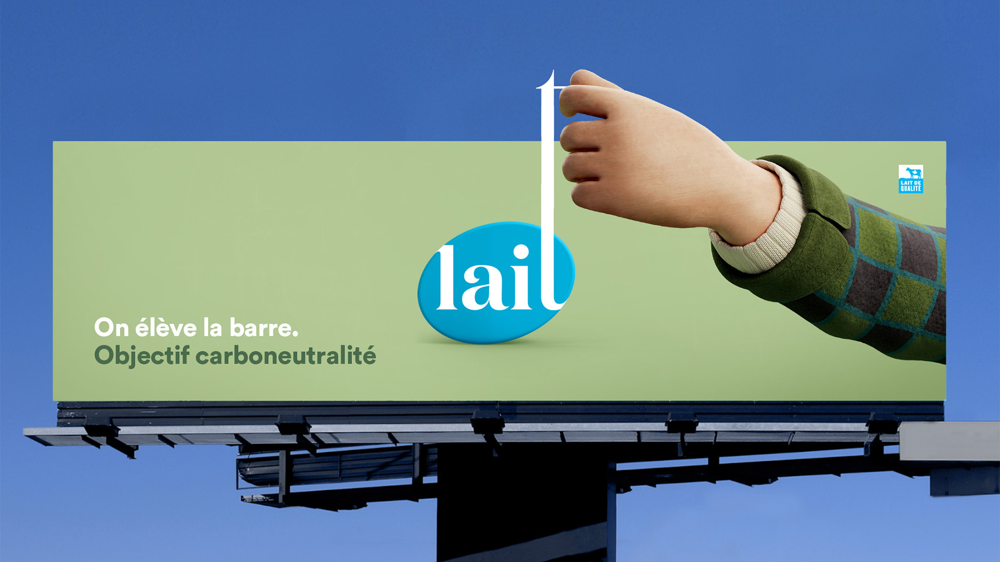
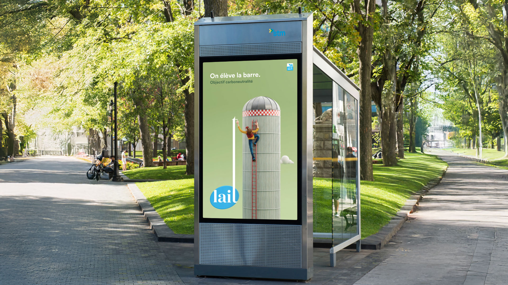
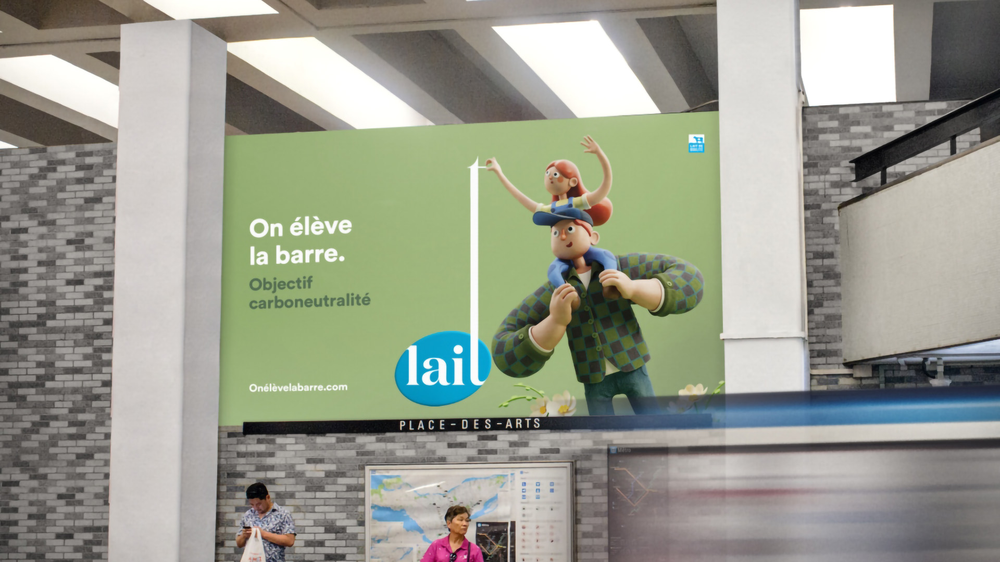
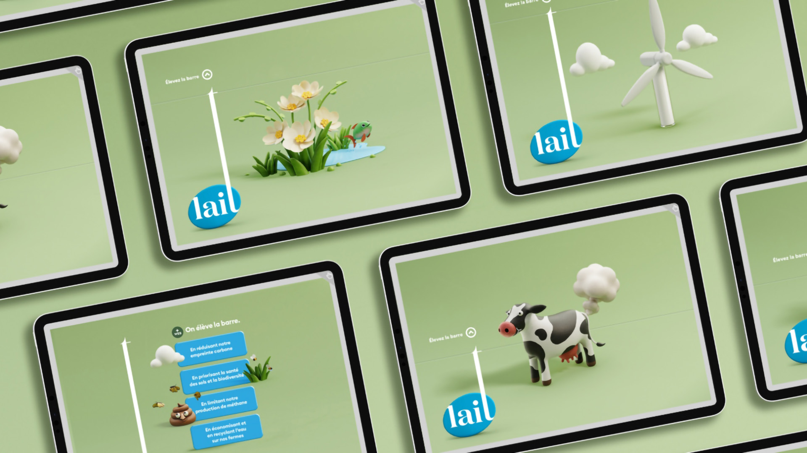

<!-- Campagne 360 valorisant leur démarche de développement durable orientée vers la carboneutralité. -->
360 campaign promoting their sustainable development approach oriented towards carbon neutrality.

<!-- Intégration numérique: bannières web statiques et animées, publicité LaPresse+, retouche d'images, déclinaisons de formats. -->
Digital integration: static and animated web banners, LaPresse+ advertising, image editing, format variations.

Agency: LG2

Client: Les Producteurs de lait du Québec (PLQ)

[Read more on Grenier, here (french)]( https://www.grenier.qc.ca/actualites/29702/les-producteurs-de-lait-du-quebec-elevent-la-barre ).
